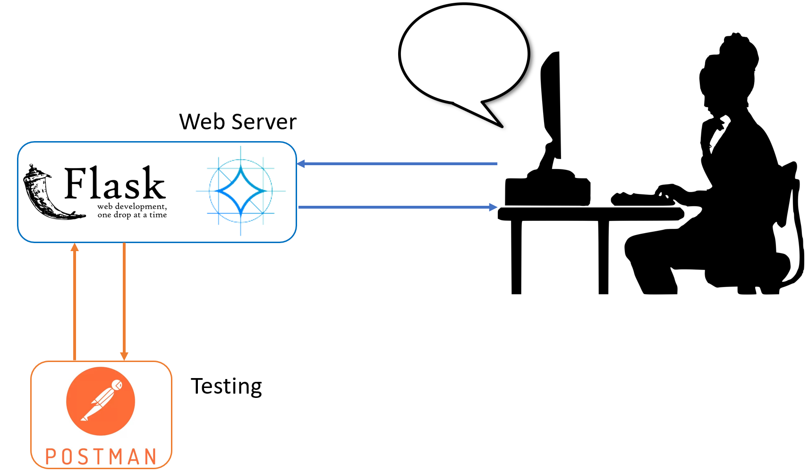

# RAG-Gemma: Retrieval Augmented generation chatbot By Integrating Google Gemma 7B LLM, BAAI/bge-large-en, Langchain, ChromaDB, and Gradio

**The chatbot offers versatile usage through two distinct methods:**
1. **Offline Documents**: Engage with documents that you've pre-processed and vectorized. These documents can be seamlessly integrated into your chat sessions.
2. **Real-time Uploads:** Easily upload documents during your chat sessions, allowing the chatbot to process and respond to the content on-the-fly.

* The project provides guidance on configuring various settings, such as adjusting the Gemma model's temperature, top_p, and top_k for optimal performance.
* The user interface is designed with gradio, ensuring an intuitive and user-friendly experience.
* For each response, you can access the retrieved content along with the option to view the corresponding PDF. 

## RAG-Gemma Schema

  

## LLM serving schema

  

